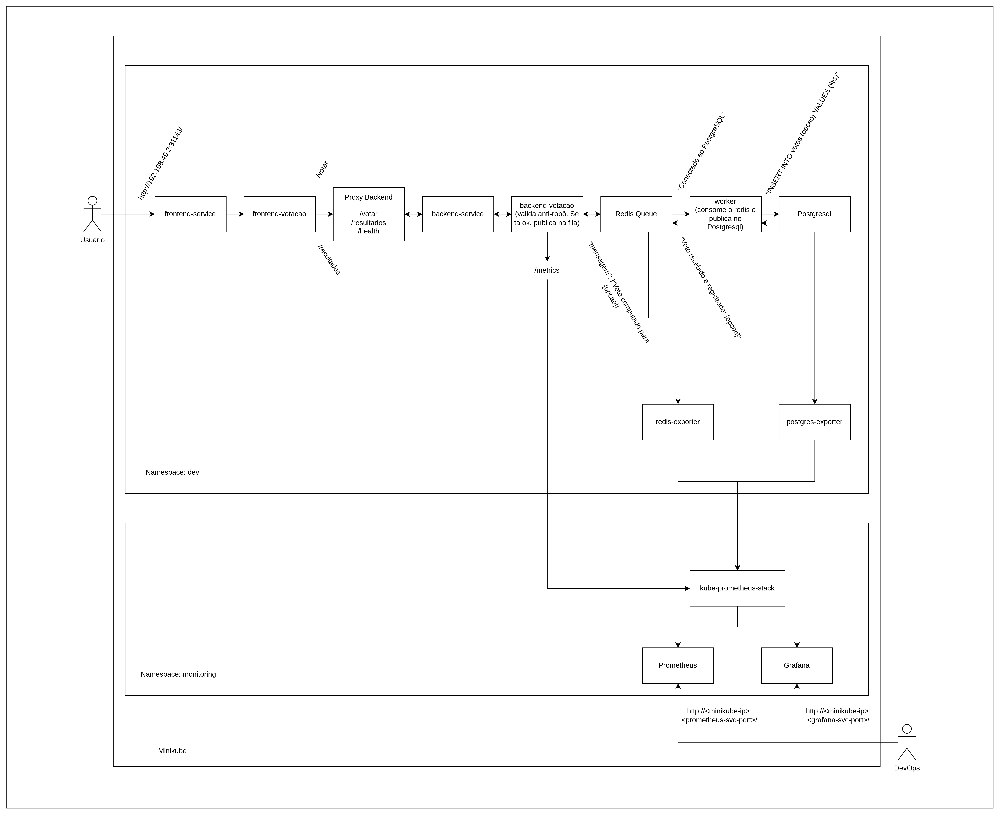

# Desafio de Infra

Autora: Anna Araujo

Criação do documento: 10/04/2025 

## 1. Ferramentas utilizadas

As ferramentas utilizadas para a criação deste ambiente foram:

- Minikube
- Ngrok
- Terraform
- Github Actions
- Helm

Este ambiente para o desafio foi criado pensando em uma maior otimização de custos (para não utilizar clouds públicas).

## 1.1 Arquitetura



Na arquitetura mostrada na imagem acima, pode demonstrar que:
- O usuário votante acessará o frontend pelo seu respectivo service
- O nginx que está dentro da imagem Docker do frontend tem em seu nginx.conf as rotas que precisam ser chamadas no service do backend
- O deployment backend-votacao (acessível pelo seu respectivo service), valida o desafio anti-robô (que, neste laboratório, é uma operação de soma simples para diminuição de complexidade) e publica em uma fila Redis
- O worker, que é uma outra aplicação que compõe o ecossistema do backend, consome essa fila do Redis e publica os votos no PostgreSQL


## 2. Configurações de Uso

### 2.1 Criação e exposição do Minikube local para uso do Github Actions

1) Considerando que o Minikube roda localmente, o primeiro desafio foi torná-lo visível para uma esteira de CI no Github Actions. Para tal, foi necessário instalar o Minikube na máquina local, utilizando a [documentação oficial](https://minikube.sigs.k8s.io/docs/start/?arch=%2Flinux%2Fx86-64%2Fstable%2Fbinary+download).

2) Após a instalação, é possível inicializar o ambiente com:
```
minikube start
```

3) Com o minikube operante, já é possível começar a fazer um proxy para fazer a exposição do cluster local.

4) Antes de expor o cluster para o Github Actions, porém, é necessário aplicar conceitos de:

- Cluster Role Binding
- Service Account
- Secrets

Antes eles estavam sendo criados por manifestos no diretório k8s/config/, mas foi feita uma modificação para que estes recursos fossem criados via Terraform (exceto a secret, que possui uma limitação por um erro no Terraform que não reconhece que o Service Account está criado, portanto apenas a secret será criada como manifesto). 

Assim, o Minikube já estará com as permissões prontas para que o github tenha a devida permissão de acesso ao cluster. É importante observar que, no cluster role binding, a permissão deve ser do tipo "cluster-admin":

```
roleRef:
  kind: ClusterRole
  name: cluster-admin
  apiGroup: rbac.authorization.k8s.io
```

Para que o user do github possa aplicar as configurações via Actions. Acesse o diretório **k8s/config** para mais detalhes sobre o manifesto da secret e o **infra/dev** para a configuração da infra do Minikube como código.

Executa-se localmente o manifesto da secret no minikube:

```
kubectl apply -f secret-github-sa.yaml
```

5) A secret criada gerará um token, que será parte fundamental da configuração. Para retornar esse token, executar localmente:
```
kubectl -n kube-system get secret github-sa-token -o jsonpath="{.data.token}" | base64 -d && echo
```

6) Esse token deverá estar atualizado no kubeconfig criado localmente para a criação do contexto no cluster para o Github. O arquivo **ngrok.yaml** ficará assim:
```
apiVersion: v1
kind: Config
clusters:
- cluster:
    server: <endereço-de-exposição-do-ngrok>
    insecure-skip-tls-verify: true
  name: minikube
contexts:
- context:
    cluster: minikube
    user: terraform-sa
    namespace: default
  name: minikube
current-context: minikube
users:
- name: terraform-sa
  user:
    token: <token-retornado-no-passo-anterior>
```
**Esse arquivo ficará localizado na máquina local, no .kube**

Para testar o funcionamento da config, pode-se executar o comando:
``` 
KUBECONFIG=ngrok.yaml kubectl get pods -A
```

Assim, é possível comprovar que o novo contexto está funcional.

7) Com essas informações em mãos, já é possível buscar as últimas peças para a montagem de permissões. Já posso começar expondo o meu minikube com:
```
kubectl proxy --address=0.0.0.0 --accept-hosts='.*'
```

8) O ngrok ajudará a expor o cluster de maneira que ele seja acessível ao github. Para tanto, é necessário instalar a CLI do ngrok e fazer uma conta gratuita (que, mesmo com as limitações, atenderá a este laboratório). Instalar de acordo com a [documentação oficial do ngrok](https://dashboard.ngrok.com/get-started/setup/linux)

9) Após a instalação da CLI do ngrok, pode-se expor o ambiente local utilizando:
```
ngrok http 8001
```

10) Com a exposição completa, surgirá uma URL do tipo:
```
https://abcd-efgh-ijk-lmno-pqrs-tu-vwxy.ngrok-free.app
```

Essa URL é a peça faltante par terminar a configuração do ngrok.yaml do passo 6.

11) Agora que o Minikube tem o kubeconfig (que aqui é chamado ngrok.yaml) que cria o contexto para a exposição via ngrok, já é possível torná-lo conhecido pelo github. Para isso, pode-se criar uma secret no repositório do github clicando em **"settings" > "secrets" > "actions"**, onde será possível criar um key=value com o ngrok.yaml codificado em base64. Extrai-se o base64 com:
```
base64 -w 0 ngrok.yaml > kubeconfig_b64.txt
```

E copia-se o conteúdo do arquivo **kubeconfig_b64.txt** para uma chave de mesmo nome no secrets do repositório:

Ou seja: Para o github, a key value, será:
``` 
KUBECONFIG_B64=<conteúdo-do-kubeconfig_b64.txt>
```

### **Observação importante!** 
Todas as vezes que o minikube for exposto via ngrok, **o ngrok.yaml, bem como o base64 e a secret no github, deverão ser atualizados!** 
Isso se deve pela volatilidade do endereço criado pelo ngrok toda vez que ele é exposto. Esse endereço é atualizado no ngrok.yaml, que consequentemente gera um base64 diferente, que deverá ser conhecido pelo Github.

12) Agora que já está tudo configurado do lado do ambiente local e do github, pode-se começar a pensar no workflow para deployar as aplicações de frontend e backend. O arquivo de configuração da esteira que atenderá o minikube é o **.github/workflows/deploy-dev.yaml**

### 2.2 Gerenciamento da infraestrutura

No diretório **infra/dev** é possivel encontrar 2 arquivos de configuração do terraform, que setam o minikube como provider e criam os namespaces, service account e cluster role bindings via terraform. Por enquanto, só estão sendo criados os namespaces *dev* e *monitoring*.

### 2.3 Criação de imagens Docker e build-push via Github Actions

1) Foram criadas 2 aplicações simples de backend e frontend. Elas consistem em:

Frontend: Recebe requests de usuários, que terão que votar entre 2 opções disponíveis

Backend: Recebe e computa os votos em um banco de dados simples

Esses arquivos que compõem a aplicação podem ser encontrados no diretório **apps/backend e apps/frontend**, bem como seus Dockerfiles, que serão montados pelo workflow **build-push.yaml** e "empurrados" para o Dockerhub correspondente.

### **Observação importante!** 
Para que o Github Actions saiba como logar no Docker Hub, será necessáro criar outras 2 secrets que permitirão essa interação. São elas:
- DOCKERHUB_TOKEN
- DOCKERHUB_USERNAME

A criação do token para o Dockerhub pode ser feita acessando a conta do Dockerhub e clicando no canto superior direito em **"Settings" > "Personal access tokens" > "New access token"**.

### 2.4 Criação de deployments e services

No diretório **k8s/dev/deployment**, encontram-se os arquivos yaml que criam o conjunto de deployment e service das aplicações, utilizando a imagem que foi "buildada" e "empurrada" pelo workflow do Github Actions. Esses arquivos são aplicados utilizando workflows do Github Actions. Mais detalhes sobre o funcionamento do workflow de deploy podem ser encontrados no item 2.1 deste documento.

A secret necessária para a autenticação no PostgreSql contida em **/k8s/config** deve ser criada utilizando:

```
kubectl apply -f secret-postgres.yaml
```

É importante relembrar a razão: este laboratório apresentou uma limitação na criação de secrets via IaC e, portanto, estão sendo criadas **antes** dos deployments, como preparação do ambiente.

### 2.5 Monitoramento

O monitoramento foi criado utilizando a kube-prometheus-stack do Helm. Isso se deve ao fato de que a stack já possui todos os parâmetros necessários para que o Service Discovery funcione.

Seus manifestos podem ser encontrados no path **/k8s/monitoring**. Eles são aplicados via workflow, pelo **deploy-monitoring-stack-v2.yaml**.

O monitoramento lê dados expostos pelo:

- Backend (/metrics no PodMonitor do backend-deploy.yaml)
- Redis (k8s/dev/deployment/redis-exporter-deploy.yaml)
- PostgreSql (k8s/dev/deployment/postgres-exporter-deploy.yaml)

Com isso, é possível ver:

#### 2.5.1 Métricas da aplicação do backend (sistema de votação)

O backend possui algumas métricas instrumentadas do tipo prometheus_client do Python:

✅ Total de votos por opção:
promql:
```
votos_total
```

✅ Separando o somatório por opões disponíveis para voto:

promql:
```
sum by (opcao) (votos_total)
```

⏱️ Tempo médio de resposta das requisições:
promql:
```
rate(flask_http_request_duration_seconds_sum[1m]) 
/ 
rate(flask_http_request_duration_seconds_count[1m])
```

❌ Número de falhas por código HTTP:
promql
```
sum by (status_code) (rate(flask_http_request_total{status_code!~"2.."}[5m]))
```

#### 2.5.2 Métricas do Redis (via redis-exporter)

O Redis está com métricas expostas (via redis-exporter):

📊 Tamanho da fila de votos:
Pelo nome da fila (votos):

promql:
```
redis_list_length{key="votos"}
```

🔁 Taxa de enfileiramento:
promql
```
rate(redis_commands_total{command="lpush"}[1m])
```

✅ Taxa de consumo:
promql
```
rate(redis_commands_total{command="rpop"}[1m])
```

#### 2.5.3 Métricas do PostgreSQL

Via postgres-exporter:

📄 Conexões ativas:
promql
```
pg_stat_activity_count
```

🔁 Transações por segundo:
promql
```
rate(pg_stat_database_xact_commit[1m]) 
+ 
rate(pg_stat_database_xact_rollback[1m])
```

### 3. Pontos de Melhoria (WIP)

Alguns pontos de melhoria para este laboratório:

- Criar um chart para deployar os serviços do app via Helm com toda a estrutura necessária (Services, ServiceMonitor, PodMonitor, e afins)
- Melhorar a segurança das secrets (apesar que, para um laboratório local, funciona razoavelmente bem)
- Automatizar a exposição do Minikube via ngrok e atualização do ngrok.yaml com um script em bash ou em python

### 4. Referências

- [Deploy Kubernetes resources in a Minikube Cluster](https://dev.to/chefgs/deploy-kubernetes-resources-in-minikube-cluster-using-terraform-1p8o)
- [Docker: Use Access Tokens](https://docs.docker.com/security/for-developers/access-tokens/)
- [Ngrok: Setup and Installation](https://dashboard.ngrok.com/get-started/setup/linux)
- [Terraform Registry: Cluster Role Binding](https://registry.terraform.io/providers/hashicorp/kubernetes/latest/docs/resources/cluster_role_binding_v1)
- [Terraform Registry: Service Account](https://registry.terraform.io/providers/hashicorp/kubernetes/latest/docs/resources/service_account)
- [How to create a monitoring stack using kube-prometheus-stack](https://medium.com/israeli-tech-radar/how-to-create-a-monitoring-stack-using-kube-prometheus-stack-part-1-eff8bf7ba9a9)